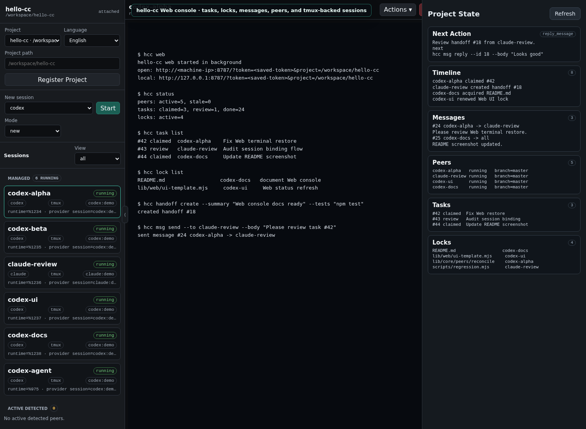

# hello-cc

<p align="center">
  
</p>

<p align="center">
  <a href="https://github.com/Dullne/hello-cc"></a>
  <a href="https://www.npmjs.com/package/@logicseek/hello-cc"></a>
  <a href="https://nodejs.org">=24"></a>
  <a href="./LICENSE"></a>
</p>

<p align="center"><b>English</b> | <a href="README.zh-CN.md">中文</a></p>

`hello-cc` is a local control plane for Claude Code, Codex, and other coding
CLI sessions. It gives every terminal in one project a shared task board,
mailbox, lock table, and browser console while keeping the real local terminal
as the source of interaction.

<p align="center">
  
</p>

<p align="center">
  <em>One local Web console for tmux-backed Claude Code, Codex, tasks, locks, messages, and handoffs.</em>
</p>

It is built for developers who run multiple AI coding agents in the same repo
and need them to coordinate instead of guessing what the other sessions are
doing.

## Highlights

- **Shared project memory**: peers, tasks, messages, locks, handoffs, and
  events are stored in `<project>/.hello-cc/mesh.db`.
- **Real terminal control**: Web attaches to the same local tmux pane as your
  terminal, not a separate browser-only shell.
- **Claude/Codex awareness**: hooks inject live `hcc` state before model turns,
  so agents can answer from current project state.
- **Conflict avoidance**: advisory locks and handoffs make multi-agent editing
  explicit.
- **Explicit team splits**: `hcc team plan/start/status` turns one parallel
  task into auditable child tasks without hidden auto-spawning.
- **Resume-friendly identity**: resumed Claude/Codex sessions map back to
  stable peers when provider session ids are available.
- **One console, many projects**: one local Web runtime can switch between
  registered project roots.

## Install And Manage

Node.js 24 or newer is required.

```bash
npm install -g @logicseek/hello-cc
```

Update an existing global install:

```bash
hcc update
```

Or run it without a global install:

```bash
npx @logicseek/hello-cc web
```

Remove hooks and shims from this machine:

```bash
hcc uninstall
```

Remove the global npm package:

```bash
npm uninstall -g @logicseek/hello-cc
```

## Quick Start

Run this inside the project you want agents to share:

```bash
cd /path/to/project
hcc web
```

Then open the printed URL. By default, `hcc web` listens on LAN interfaces and
requests `0.0.0.0:8787`, using a saved URL token generated on first use. If
port 8787 is already busy and you did not pass `--port`, it automatically tries
the next available port. The command prints both the LAN login URL and the local
loopback URL:

```text
open: http://<machine-ip>:8787/?token=<saved-token>&project=/path/to/project
local: http://127.0.0.1:8787/?token=<saved-token>&project=/path/to/project
```

Use `--local` to bind only to `127.0.0.1`, or `--port N` to request a specific
port. `hcc web` initializes the project bus, installs Claude/Codex hooks and
shims, starts or reuses the Web console, and returns the terminal to you.

After the first shim install, open a new terminal or reload your shell:

```bash
source ~/.bashrc
```

Start normal agent sessions from the project:

```bash
claude
codex
claude --resume <session-id>
codex resume <session-id>
```

Those sessions become tmux-backed peers that can be seen and controlled from
Web while remaining usable from the local terminal.

## Basic Workflow

```bash
hcc task create --title "Review router changes" --priority 20
hcc task next
hcc lock acquire --resource src/router --ttl 900 --reason "edit router"
hcc status
hcc handoff create --summary "Router change ready for review" --tests "npm test"
hcc task done --id 1 --summary "Done"
```

Ask an agent what is happening in the project:

```text
What are the other hello-cc sessions doing?
```

Attached Claude/Codex sessions should answer from live `hcc` state rather than
generic session-isolation assumptions.

## Documentation

- [Documentation Index](docs/README.md): all user and implementation docs.
- [User Guide](docs/guide.md): setup, Web console, workflows, coordination
  semantics, and environment behavior.
- [Command Reference](docs/commands.md): compact public command list.
- [Changelog](CHANGELOG.md): release notes for published versions.
- [Design Notes](docs/design.md): product boundaries and coordination model.
- [Implementation Notes](docs/implementation.md): architecture and internal
  protocol.

## Testing

```bash
npm test
```

The regression suite uses temporary projects, fake Claude/Codex binaries,
temporary tmux sessions, and a temporary Web runtime to test the main flows.

## License

[Apache-2.0](LICENSE)

---

<p align="center">
  <a href="https://star-history.com/#Dullne/hello-cc&Date">
    
  </a>
</p>
