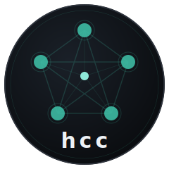

# hello-cc

<p align="center">
  
</p>

<p align="center">
  <a href="https://github.com/Dullne/hello-cc"></a>
  <a href="https://www.npmjs.com/package/hello-cc"></a>
  <a href="https://nodejs.org">=24"></a>
  <a href="./LICENSE"></a>
</p>

<p align="center"><a href="README.md">English</a> | <b>中文</b></p>

`hello-cc` 将 Claude Code、Codex 和其他编程 CLI 会话连接成一个**项目本地对等网格**。命令为 `hcc`。

hello-cc 的默认模型是扁平协作网格，不区分固定的 main/worker。每个终端会话都是一个命名 peer，可以看到同一项目中的未完成任务、接收发给自己的消息、持有锁、交接进度，也可以被 Web 控制台观察和操作。

```text
<project>/.hello-cc/mesh.db
```

## 安装

**Node 24+ 是必需的**，因为 hello-cc 使用内置 `node:sqlite`。

全局安装：

```bash
npm install -g hello-cc
```

也可以通过 npm 单次运行：

```bash
npx hello-cc web
```

全局安装后，`hcc` 和 `hello-cc` 两个命令都可用；本文示例使用 `hcc`。

## 默认入口

安装后只需要在项目目录运行：

```bash
cd /path/to/project
hcc web
```

`hcc web` 是默认一条命令入口。它会自动完成这些事情：

1. 在当前目录初始化 `.hello-cc/mesh.db`
2. 写入受控项目指导块：`.hello-cc/HCC.md`、`CLAUDE.md`、`AGENTS.md`
3. 安装或刷新 Claude Code hooks：`~/.claude/settings.json`
4. 安装或刷新 Codex hooks：`~/.codex/hooks.json`
5. 安装 `~/.hcc-shims/claude` 和 `~/.hcc-shims/codex`
6. 将 `~/.hcc-shims` 加入 shell PATH
7. 检查 `tmux`，缺失时尽量自动安装；安装失败会打印明确的系统安装命令
8. 后台启动或复用全局 Web 控制台，注册当前项目，打印 URL、PID、runtime 文件和日志文件，然后把当前终端还给用户

输出示例：

```text
hello-cc web started in background
pid: 12345
project: /path/to/project
database: /path/to/project/.hello-cc/mesh.db
runtime: /path/to/project/.hello-cc/runtime.json
log: /path/to/project/.hello-cc/web.log
open: http://<machine-ip>:8787/?project=%2Fpath%2Fto%2Fproject
local: http://127.0.0.1:8787/?project=%2Fpath%2Fto%2Fproject
shims: installed claude, codex
PATH updated in ~/.bashrc; open a new terminal or source it
stop: hcc down
```

`hcc web` 使用单个全局 Web runtime。你在另一个项目目录再次运行 `hcc web` 时，不会再开一个端口，而是把那个项目注册到同一个 Web 控制台。前端左侧的 Project 下拉框可以在不同项目 root 之间切换；每个项目仍然使用自己的 `.hello-cc/mesh.db`，任务、消息、锁和 peers 不会混在一起。

第一次安装 shim 后，需要打开一个新终端，或执行：

```bash
source ~/.bashrc
```

之后在这个项目目录中直接输入：

```bash
claude
codex
claude --resume <session-id>
codex resume <session-id>
```

这些命令会被 hello-cc shim 包装为**本机 tmux 常驻终端**：

- 本地终端会 attach 到同一个 tmux 会话，仍然可以像普通 Claude/Codex 一样交互。
- Web 控制台看到并操作的是同一个 tmux pane，不是浏览器里临时创建的假终端。
- `hcc down` 只停止 Web runtime，不会杀掉这些 tmux 会话。
- 重新运行 `hcc web` 后，只要 tmux pane 还活着，Web 会重新接管。

如果只想初始化本地通信、不启动 Web、不安装 shim，可使用低级命令：

```bash
hcc up
```

普通用户优先使用 `hcc web`。

## 项目边界

默认项目边界就是**当前工作目录**。如果当前目录没有 `.hello-cc/mesh.db`，hello-cc 会在首次使用时创建：

```text
/repo-a/.hello-cc/mesh.db
/repo-a/subdir/.hello-cc/mesh.db
```

这两个目录默认是两个不同项目，不会互相看到任务和消息。也就是说，想让多个终端自然通信，就在同一个项目目录启动它们。

如果确实要让多个路径或 worktree 共用一个总线，需要显式指定：

```bash
hcc --root /path/to/project web
export HCC_ROOT=/path/to/project
export HCC_DB=/path/to/project/.hello-cc/mesh.db
```

hello-cc 不会自动向父目录继承项目边界，这样可以避免子目录会话误加入上层项目。

## 通信模型

hello-cc 的通信不是 CLI 之间点对点互发，也不是必须依赖 MCP。核心是项目本地 SQLite WAL 总线：

```text
Claude/Codex/普通 shell
  -> hooks / hcc 命令 / Web runtime
  -> .hello-cc/mesh.db
  -> peers / tasks / messages / locks / handoffs / events
  -> tmux-backed terminal control
```

任务和消息的读取规则不同：

- **任务**是项目事实。所有 peer 默认都能看到未 `done` 且未 `abandoned` 的任务。任务不因为某个终端读过就消失。
- **消息**是带收件人的邮箱消息。`hcc msg inbox` 默认读取当前 peer 的未读消息，`hcc msg ack` 记录每个 peer 的已读状态。
- `ask` 和 `broadcast` 会写入持久消息；加 `--inject` 时，还会把内容实时注入到 Web runtime 已接管的终端。
- 锁使用 SQLite 事务和 TTL，是协作式冲突避免，不是文件系统强制沙箱。

## Claude/Codex 如何知道其他会话状态

主链路是 hooks 注入，不是依赖 `CLAUDE.md`。

`hcc web` 会安装 Claude Code 和 Codex hooks。在会话启动、用户提交 prompt、工具调用前后、会话空闲等事件中，hooks 会把 hello-cc 当前快照注入给模型，包括：

- 当前 peer 身份
- 活跃 peer 列表
- 未完成任务
- 当前 peer 的未读消息
- 活跃锁
- 建议执行的 `hcc status`、`hcc peers`、`hcc task list`、`hcc msg inbox`、`hcc lock list`

因此，当你在已接入的 Claude/Codex 里问“其他会话在做什么”，模型应该基于 hello-cc 注入的最新状态回答，而不是回答“我无法知道其他会话”。

如果仍然回答不知道，通常是这些原因：

- 没有先在项目目录运行 `hcc web`
- 当前终端还没有加载 `~/.hcc-shims` PATH
- Codex hooks 没有开启，或安装后的 hook 还没有在 Codex 的 hook review 流程里信任
- Claude/Codex 是在不同项目目录启动的
- 当前会话是 `hcc web` 之前打开的 raw 终端，只能靠下一次 hook 事件加入通信，不能被 Web 视觉接管
- 对应 CLI 版本没有触发预期 hook

可以在同一个项目目录用一次性 debug 调用确认 Claude Code 是否真实注入：

```bash
claude -p 'Do you see hello-cc open tasks?' --debug hooks --debug-file /tmp/hcc-claude-hooks.log
```

debug 日志里应该出现 `Hook UserPromptSubmit ... provided additionalContext`，并包含
`hello-cc coordination` 块。如果这里已经存在，但模型仍然按通用知识回答“会话隔离”，请通过
shim 重新启动或 resume 会话后再问；hello-cc 会在每次新用户 prompt 时注入更强的约束。

## Web 控制台

默认本机和内网访问：

```bash
hcc web
```

需要令牌时再显式开启：

```bash
HCC_WEB_TOKEN='choose-a-long-token' hcc web --host 0.0.0.0 --port 8787
```

同一内网机器打开：

```text
http://<machine-ip>:8787/
```

Web 控制台能做两类事情：

- 在一个端口里切换多个已注册项目 root
- 直接在浏览器里注册新的项目路径，不需要为每个项目再启动一个 Web 服务
- 查看项目状态：peers、tasks、messages、locks、handoffs、events
- 操作本地终端：启动 Claude/Codex/shell、发送键盘输入、查看输出、停止接管
- 启动新会话时只需要选择 kind；表单会自动生成当前项目内的下一个别名，使用当前选中的 Project root 作为工作目录，并运行该 kind 的默认命令

Web 操作的是 hello-cc 管理的本机 tmux 终端：

- 通过 Web 表单启动的新会话：tmux-backed
- 通过 `hcc peer start` 启动的新会话：tmux-backed
- 通过 shim 直接输入 `claude` / `codex` 启动的新会话：tmux-backed
- 通过 `hcc peer attach` 接入的已有 tmux pane：tmux-backed

已经打开的普通 raw 终端不能被无条件捕获或控制，除非它原本就在 tmux、screen 或 hello-cc shim 之下。它仍然可以通过 hooks 和 `hcc` 命令参与任务、消息和锁。

## 常用命令

```text
# 默认入口
hcc web [--host HOST] [--port N] [--token TEXT] [--local] [--no-discover] [--no-guidance]
hcc down

# 本地协调，无 Web
hcc up [--no-discover] [--no-guidance]

# 对等节点和状态
hcc peers
hcc status [--peer ID]
hcc scan [--register]
hcc prompt --peer ID [--kind codex|claude|shell|other] [--role ROLE]
hcc join --peer ID [--kind codex|claude|shell|other] [--role ROLE]
hcc env --peer ID
hcc heartbeat [--peer ID] [--renew-locks --ttl 900]
hcc run --peer ID --kind codex|claude|shell --role ROLE -- COMMAND [ARGS...]

# Web 可控终端
hcc peer list
hcc peer start PEER [--kind K] [--role R] [--cwd DIR] [--restart-env] -- COMMAND [ARGS...]
hcc peer start PEER --kind codex --resume SESSION_ID [--restart-env]
hcc peer start PEER --kind codex --last
hcc peer start PEER --kind claude --resume SESSION_ID [--restart-env]
hcc peer start PEER --kind claude --continue
hcc peer attach PEER [--pane PANE] [--kind K] [--role R] [--cwd DIR]
hcc peer stop PEER
hcc inject PEER TEXT [--no-enter]

# 消息
hcc msg send [--from ID] [--to ID|all] --body TEXT [--task N] [--kind note|task|handoff]
hcc msg inbox [--peer ID] [--wait SEC] [--all] [--limit N]
hcc msg ack [--peer ID] --id N
hcc ask PEER MESSAGE [--from ID] [--task N] [--inject]
hcc broadcast MESSAGE [--from ID] [--task N] [--inject]

# 任务
hcc task create --title TEXT [--body TEXT] [--from ID] [--to ID] [--priority N]
hcc task list [--status S] [--peer ID] [--all]
hcc task claim [--peer ID] --id N
hcc task next [--peer ID]
hcc task update [--peer ID] --id N --status running|review|blocked|done|abandoned [--summary TEXT] [--body TEXT] [--to ID]
hcc task done [--peer ID] --id N --summary TEXT

# 锁和交接
hcc lock acquire [--peer ID] --resource PATH [--task N] [--ttl SEC] [--reason TEXT]
hcc lock renew [--peer ID] --resource PATH [--ttl SEC]
hcc lock release [--peer ID] --resource PATH [--force]
hcc lock list [--all]
hcc handoff create [--from ID] --summary TEXT [--task N] [--to ID] [--changed-files JSON_OR_CSV] [--tests TEXT] [--risks TEXT]
hcc handoff list [--task N] [--limit N]
hcc event tail [--limit N]
hcc gc [--older-than DAYS] [--yes]
```

## 稳定 peer 身份

hello-cc 会尽量让恢复会话复用稳定 peer ID：

| 启动方式 | peer ID |
|---|---|
| `claude --resume abc12345...` | `claude-abc12345` |
| `claude --session-id abc12345...` | `claude-abc12345` |
| `claude --continue` | 先使用终端派生 ID，随后 hooks 记录真实 session 元数据 |
| `claude --fork-session --resume abc12345...` | 先使用终端派生 ID，随后 hooks 记录新 session 元数据 |
| `codex resume abc12345...` | `codex-abc12345` |
| `codex resume --last` | 先使用终端派生 ID，随后 discovery 记录真实 session 元数据 |
| 普通 shell | `shell-<terminal>` |
| 手动 `HCC_PEER=xxx` | 使用 `xxx` |

已知 resume ID 的会话重启后会保持同一个 peer ID。启动前不知道真实 provider session ID 的模式，会先用终端派生 ID，启动后再记录真实 provider session 元数据。

## 典型工作流

创建任务：

```bash
hcc task create --title "重构路由诊断" \
  --body "保持变更范围小。" --priority 20
```

认领并加锁：

```bash
hcc task next
hcc lock acquire --resource vllm/router --ttl 900 --reason "实现路由诊断"
```

发消息或实时注入：

```bash
hcc msg send --to claude-a --body "实现已准备好供审查。"
hcc ask claude-a "请审查当前实现。" --inject
hcc broadcast "暂停编辑 vllm/router，等待任务完成。" --inject
```

完成并交接：

```bash
hcc handoff create --to claude-a \
  --summary "已实现路由诊断变更。" \
  --tests "pytest tests/router" \
  --risks "未跑完整基准"

hcc task done --id 1 --summary "已完成并交接。"
hcc lock release --resource vllm/router
```

## 技术栈

```text
Node.js >= 24
node:sqlite + SQLite WAL
Node HTTP server
ws WebSocket
xterm.js
tmux create/capture/send
Claude Code hooks
Codex hooks
shell shim wrappers
```

A2A 和 MCP 不是核心必需项。A2A 更适合远程 agent 互操作，MCP 可以作为后续工具层；本地多终端协作的主链路是 hooks + SQLite + tmux。

## 测试

```bash
npm test
```

回归脚本会创建临时项目、临时 `HOME`、fake `claude`/`codex`、临时 runtime 端口和临时 tmux session。覆盖 `hcc web` 自动 bootstrap、单端口多项目注册、hooks/shims、SQLite 协作流、tmux-backed `peer start` 创建和恢复、shim 启动 tmux peer、tmux attach、WebSocket 终端流、终端注入、runtime 停止、package dry-run 和旧命名扫描。

## 架构

```text
hcc CLI
  ├── lib/discover.mjs    Claude/Codex 会话发现
  ├── lib/setup.mjs       hooks、shims、PATH 安装
  ├── bin/hcc.mjs         CLI、SQLite、Web runtime、tmux 控制
  └── .hello-cc/
        ├── mesh.db       协调状态
        ├── HCC.md        项目指导规则
        ├── runtime.json  Web runtime 发现文件
        └── web.log       Web runtime 日志
```

## 环境变量

| 变量 | 用途 |
|---|---|
| `HCC_PEER` | 默认 peer 身份 |
| `HCC_ROOT` | 覆盖项目根目录 |
| `HCC_DB` | 覆盖数据库路径 |
| `HCC_WEB_TOKEN` | 可选 Web 访问令牌 |
| `HCC_RUNTIME_URL` | 直接指定 runtime URL |
| `HCC_NO_AUTO_INSTALL_TMUX=1` | 禁用 tmux 自动安装，主要用于测试 |

`claude` / `codex` shim 和 `hcc peer start` 会使用**当前启动终端**的环境变量创建 tmux-backed 会话，
不使用后台 Web runtime 启动时的旧环境。这样你可以在新终端里先 `export ANTHROPIC_*`、
`CLAUDE_CODE_*` 或其他 provider 变量，再运行 `claude` / `codex`。

已经运行的 CLI 进程不能被操作系统原地修改环境变量。`claude` / `codex` shim 会用
`--restart-env` 调用 `hcc peer start`，因此 hello-cc 会为同一个 resume/session peer
记录启动环境指纹。当你从新终端再次启动它且环境已变化时，如果对应 tmux 会话没有本地
tmux client 或 Web client 正在连接，hello-cc 会自动重启这个 tmux 会话并应用新环境。
如果会话正在被操作，会提示先 detach/关闭 Web 连接，或运行 `hcc peer stop <peer>` 后再启动。

如果直接调用 `hcc peer start`，需要加 `--restart-env` 才会启用同样的环境变化自动重启行为。

shim 只接管交互式终端会话。元命令和维护命令会直通真实 provider CLI，例如
`claude --help`、`claude --version`、`claude --print`、`claude --bare`、`claude --safe-mode`、
`codex --help`、`codex --version`，以及 `codex exec`、`codex review`、`codex doctor`、
`codex mcp` 等非交互 Codex 子命令。交互式的 `claude`、`claude --resume ...`、`codex`、
`codex resume ...`、`codex fork ...` 会走 tmux-backed，会出现在 Web 控制台里。

---

<p align="center">
  <a href="https://star-history.com/#Dullne/hello-cc&Date">
    
  </a>
</p>
