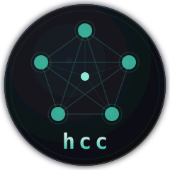
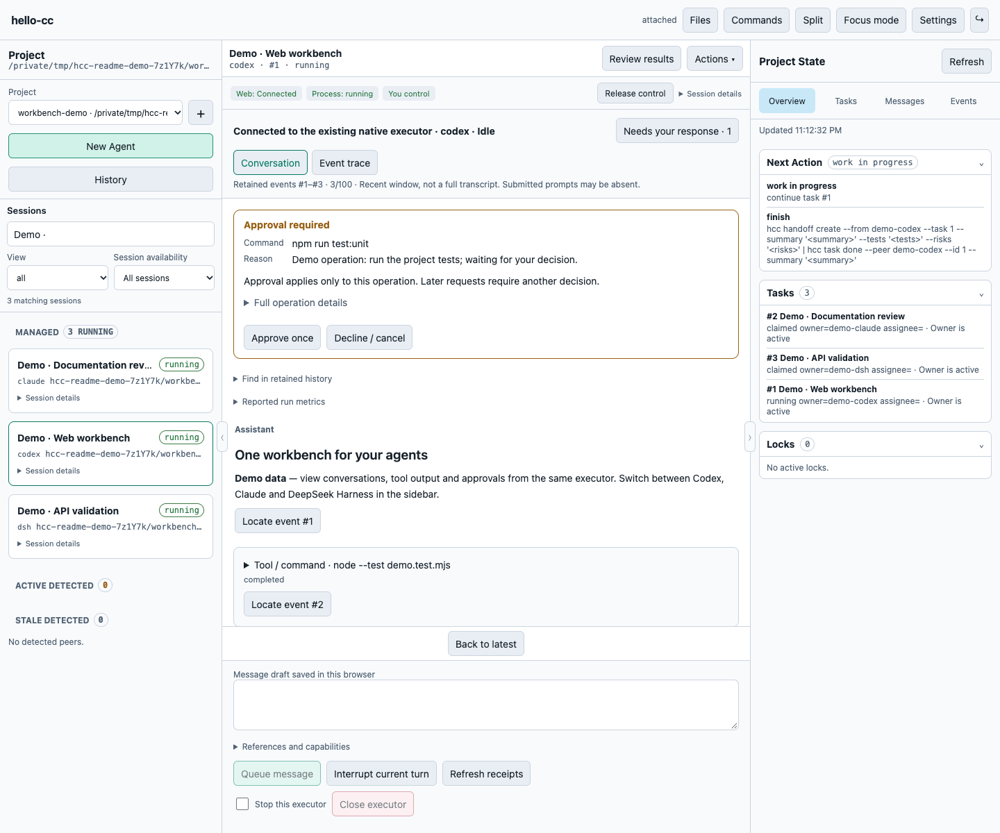

# hello-cc

<p align="center">
  
</p>

<p align="center">
  <a href="https://github.com/Dullne/hello-cc"></a>
  <a href="https://www.npmjs.com/package/@logicseek/hello-cc"></a>
  <a href="https://nodejs.org">=24"></a>
  <a href="./LICENSE"></a>
</p>

<p align="center"><a href="README.md">English</a> | <b>中文</b></p>

`hello-cc` 是 Claude、Codex 和 DeepSeek Harness 的本地多 Agent 工作台。你可以在 Web 中新建后台 Agent，查看结构化对话和工具审批，也可以继续使用真实本地终端；同一项目中的 Agent 共享任务板、消息、锁和交接。

<p align="center">
  
</p>

<p align="center">
  <em>在一个本地 Web 工作台中管理 Claude、Codex、DeepSeek Harness 后台 Agent 与受管终端。截图使用演示数据。</em>
</p>

它适合在同一个仓库里同时运行多个 AI 编程 agent 的场景：让它们知道彼此在做什么，而不是各自猜测。

## v1 兼容性与信任边界

1.1.0 将项目状态、受管启动、Web/native 会话和 Codex 历史绑定到所选目录的
文件系统身份。同一路径被替换时使用独立状态分代；历史私有 v1 绑定升级到 v2
需核实原目录并停止全部写入者。状态位置和迁移命令见
[项目目录身份与私有状态](docs/private-state.zh-CN.md)。

1.0.0 会在生成并校验升级前备份后，把项目数据库升级到 schema v7；升级后的
数据库不支持降级。provider peer ID 改为对完整 provider session 值做哈希，旧 ID
不会自动映射或迁移。受保护的接口使用 Runtime API v2，终端 action token 按
WebSocket 连接签发和撤销。

存活判断以 tmux/非 tmux 进程证据为准：休眠或 detach 不会把活进程判死，只有
unknown 证据获得最长 120 秒宽限。`hcc gc` 默认保留历史，必须显式使用
`--history`。`--tls` 提供传输加密；`--trust-proxy` 必须固定
`--proxy-origin`。两项风险是有意保留的：默认在可信内网以明文 HTTP 监听
`0.0.0.0`，且已认证浏览器可以选择服务器上任意已存在目录。

## 特色

- **多 provider 后台 Agent**：直接从 Web 新建 Claude、Codex 或 DeepSeek Harness worker，查看结构化对话、工具执行和投递回执，处理工具审批与问题。
- **项目启动默认值**：保存默认 provider、模型和项目内工作目录，供后续 Web 新建 Agent 使用。
- **项目文件与产物**：在 Web 预览文本、Markdown、HTML、图片和 PDF，显式上传文件或编辑文本。
- **项目共享 SQLite 总线**：peers、tasks、messages、locks、handoffs 和 events 保存在项目状态中；位置可以是 `<project>/.hello-cc/`、`~/.hello-cc/projects/<hash>/` 或独立 generation，详见[状态指南](docs/private-state.zh-CN.md)。
- **本地与 Web 续接**：Web 接入 HCC 持有的 native worker 或已有受管 tmux pane，继续同一执行器；本地 CLI 也可继续处理。已有桌面 App 保留自身执行器，通过单独的[接入方式](docs/app-bridge.zh-CN.md)协作。
- **Agent 感知项目状态**：Claude/Codex hooks、DeepSeek Harness 集成和受限 MCP 工具提供实时 `hcc` 状态与协作操作。
- **减少编辑冲突**：通过 advisory lock 和 handoff 显式协调多 agent 修改。
- **显式团队拆分**：`hcc team plan/start/status` 可以把一个并行任务拆成可审计
  子任务，不会隐藏地自动启动进程。
- **resume 友好的稳定身份**：当 provider 暴露 session id 时，恢复会话会映射回稳定 peer。
- **一个控制台管理多个项目**：单个本地 Web runtime 可以在多个 project root 之间切换。

## 安装和维护

hello-cc 支持 Linux 和 macOS。需要 Node.js 24 或更新版本；`hcc web` 和受管
终端需要 `tmux`。发行包包含 macOS/Linux arm64 与 x64 的目录交接 helper。
当前不支持原生 Windows shell；Windows 用户建议使用 WSL。

在运行 hello-cc 的同一环境中安装并登录所需 provider。Codex 后台 Agent 需要支持
App Server 的 Codex CLI；DeepSeek Harness 后台 Agent 需要 DSH ACP runtime；
Claude 后台 Agent 使用可选的 Claude Agent SDK，hello-cc 不会自动安装它。
具体版本和安装方式见 [Native 指南](docs/native.zh-CN.md#环境准备)。

Linux 可以通过 `/proc` 做更完整的进程自动发现。macOS 上建议通过 hello-cc
shim 或 `hcc peer start` 启动会话，以获得可靠的 tmux 托管终端。

先通过 Node.js 官方软件包或 Node 版本管理器安装 Node.js 24 或更新版本，再按
系统安装 `tmux`：

```bash
# Debian / Ubuntu
sudo apt-get update && sudo apt-get install -y tmux
# Fedora / RHEL
sudo dnf install -y tmux
# 旧版 RHEL / CentOS
sudo yum install -y tmux
# Alpine
sudo apk add tmux
# Arch Linux
sudo pacman -S --needed tmux
# openSUSE
sudo zypper install tmux
# 仅 macOS
brew install tmux
```

Linux 必须使用当前发行版的系统包管理器，而不是 Homebrew。root shell 可以省略
`sudo`。WSL 用户应在 WSL 内部执行对应 Linux 发行版的命令。然后安装并验证：

```bash
npm install -g @logicseek/hello-cc
node --version
npm --version
tmux -V
hcc --version
hcc --help
```

如果 npm 报 `EACCES`，请使用 Node 版本管理器或用户自有的 npm prefix，不要用
`sudo npm install -g` 绕过权限问题。

更新已有的全局安装：

```bash
hcc update
```

也可以不全局安装，直接运行：

```bash
npx @logicseek/hello-cc web
```

移除本机 hooks、shims 和 shell PATH 配置：

```bash
hcc uninstall
```

移除全局 npm 包：

```bash
npm uninstall -g @logicseek/hello-cc
```

## 快速开始

在需要多个 agent 共享状态的项目中运行：

```bash
cd /path/to/project
hcc web
```

然后打开命令输出里的 URL。默认情况下，`hcc web` 会监听内网地址，请求
`0.0.0.0:8787`，并在 URL 里附带为本次 runtime 自动生成的 token。如果 8787
端口已被占用，且你没有显式传 `--port`，它会自动尝试后续可用端口。启动时会同时
打印内网登录地址和本机 loopback 地址：

```text
open: http://<machine-ip>:8787/?token=<runtime-token>&project=/path/to/project
local: http://127.0.0.1:8787/?token=<runtime-token>&project=/path/to/project
```

使用 `--local` 可以只绑定 `127.0.0.1`，使用 `--port N` 可以指定请求端口。
`hcc web` 会初始化项目总线，安装 Claude/Codex hooks 和 shims，启动或复用 Web
控制台，然后把终端还给你。
`hcc web --local` 仍然是 Web 模式，只是限制监听在本机 loopback。只想使用本地
协作命令、不启动 Web 控制台、不安装 shims 时，使用 `hcc up`。

### 从 Web 新建后台 Agent

1. 打开上述 URL，选择项目并点击“新建 Agent”。
2. 选择 Codex、Claude 或 DeepSeek Harness，使用默认的“后台 Agent”方式。
3. 核对工作目录与模型后创建；模型留空使用 provider 当前配置，名称留空自动生成。
4. 在会话中发送提示，查看结构化对话与投递回执，并按需处理审批。顶部“设置”可保存项目启动默认值，“文件”可预览、上传和编辑项目文件。

后台服务按需启动，无需先运行 `hcc native start`。关闭页面或停止 Web 不会关闭
独立的后台 worker；不再需要时，明确使用“关闭执行器”或 `hcc native close --peer NAME`。
恢复已关闭的 worker 可使用项目栏“历史”中的“HCC 保留历史”。详细操作见
[Web 指南](docs/web-handoff.zh-CN.md)和 [Native 指南](docs/native.zh-CN.md)。

### 继续使用本地终端

第一次安装 shim 后，打开新终端，或根据当前 shell 重新加载配置：

- bash: `source ~/.bashrc`
- zsh: `source ~/.zshrc`
- fish: `source ~/.config/fish/config.fish`

在项目目录中正常启动 agent：

```bash
claude
codex
claude --resume <session-id>
codex resume <session-id>
```

这些会话会成为 tmux-backed peer，可以继续在本地终端里使用，也可以被 Web 控制台观察和操作。
shim 只使用解析后的当前项目 runtime；它可能位于项目局部或私有状态目录。
如果当前项目没有通过 `hcc web` 建立可用 runtime，启动 `claude` 或 `codex` 时
会回退到真实 provider CLI，不会使用全局 Web runtime，也不会为这个目录新建项目数据库。

## 基本流程

```bash
hcc task create --title "Review router changes" --priority 20
hcc task next
hcc task running --id 1 --summary "Started"
hcc lock acquire --resource src/router --ttl 900 --reason "edit router"
hcc status
hcc handoff create --summary "Router change ready for review" --tests "npm test"
hcc task done --id 1 --summary "Done"
```

在已接入的 Claude/Codex 会话中可以直接问：

```text
其他 hello-cc 会话现在在做什么？
```

它应该基于实时 `hcc` 状态回答，而不是泛泛地说“会话隔离”。

## 文档

- [文档目录](docs/README.zh-CN.md)：全部用户文档和实现文档入口。
- [用户指南](docs/guide.zh-CN.md)：安装、Web 控制台、协作流程、协作语义和环境变量行为。
- [命令参考](docs/commands.zh-CN.md)：紧凑公共命令清单。
- [项目目录身份与私有状态](docs/private-state.zh-CN.md)：v2 绑定、替换目录分代、
  离线升级及已核实的 Codex 历史边界。
- [DeepSeek Harness 接入](docs/dsh.zh-CN.md)：hooks/Cordis 协作、ACP worker、
  项目配置与 Web 启动；附真实模型和本地包验收记录。
- [Native 后台 worker](docs/native.zh-CN.md)：HCC 持有的 Codex、Claude SDK、dsh ACP
  worker，以及投递回执、权限和保存会话的所有权边界。
- [Web 新建与本地续接](docs/web-handoff.zh-CN.md)：后台 Agent、项目启动默认值、文件上传编辑、控制权和历史恢复。
- [桌面 Agent 通信](docs/app-bridge.zh-CN.md)：DSH 空闲收件唤醒、Codex 会话内协作和可选 Claude Desktop Mod。
- [设计说明](docs/design.md)与[实现说明](docs/implementation.md)（英文）：产品边界、协作语义、协议与技术栈。
- [架构设计](docs/architecture.zh-CN.md)：模块边界、依赖方向与目录结构。
- [更新日志](CHANGELOG.md)：已发布版本的 release notes。

## 测试

```bash
npm test
```

回归测试会创建临时项目、fake Claude/Codex、临时 tmux session 和临时 Web runtime，覆盖主要流程。

## License

[Apache-2.0](LICENSE)

---

<p align="center">
  <a href="https://star-history.com/#Dullne/hello-cc&Date">
    
  </a>
</p>
