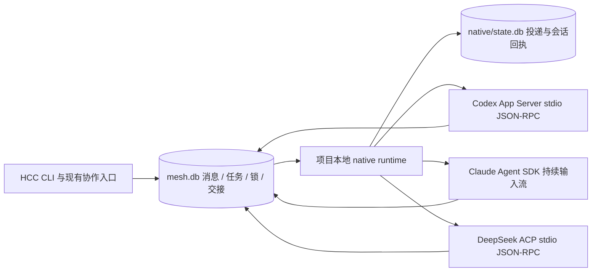

# HCC 原生 worker 适配层（第一版）

已实现项目本地 `hcc native` runtime，使 HCC 管理的后台会话通过 provider 的原生接口收发消息。跨 provider 的消息、任务、锁、交接继续使用现有 `.hello-cc/mesh.db`；无需复制任何 provider 内部 agent mailbox 或私有 desktop server。

## 实现

三个适配器具有共同的 `open / send / interrupt / close / snapshot` 接口；能力按实际 provider 协议声明，不能把不支持的 steer、fork 或恢复能力伪装为通用功能。Codex 使用 thread 与 turn 接口；Claude 使用 SDK `query()` 与 AsyncIterable 输入；DeepSeek 使用 ACP v1，恢复与 session close 必须先协商能力。

后台 runtime 仅监听 loopback，控制接口使用项目私有 bearer token。独立 TCP ownership lock 防止同项目启动多个 runtime。worker 在启动 provider 之前事务性保留其 peer binding；后续保存与回调均核验 owner，防止异步启动覆盖后来绑定的现有终端。恢复只接受本 runtime 记录过的 provider session；跨 peer 的 session binding 冲突必须拒绝。

投递先记录 durable message 与 submission ID，再交给 adapter。不同 worker 独立等待 admission；单个慢 provider 不阻塞其他 worker。每个 worker 串行消费 inbox，当前 prompt 只包含这一条消息与有界任务、锁上下文。关联输出和 completion 必须匹配 submission/turn，背景消息不得拼入业务回复。

`queued` 是 HCC 持久队列；`dispatching` 是正在提交；`submitted` 是本地 adapter 已接收；`accepted` 要求 provider admission 或关联输出证据；`completed` 要求最终 completion。SDK 读取输入迭代器本身不证明 provider 已接受。收到成功 completion 才在一个 mesh 事务里写 reply 与 ACK；kind 为 reply 的消息只作为上下文投递并 ACK，输出留在 provider events，不再次自动 reply，以防止原生 worker 间的自动回复循环。关闭、重启或连接异常留下的未确认投递标记为 `uncertain`，不会自动重放。跨两个 SQLite 数据库不存在一个共同事务，因此极端崩溃后可能留下业务 reply/ACK 已提交但 native receipt 不确定；该状态仍须人工核对，不应自动重发。

provider 子进程仅继承显式 worker 的 HCC 身份。已安装 hooks 对 native-owned worker 只保留心跳和锁续期，禁止再次注入 inbox、提前 ACK、改写绑定或用 Stop hook 触发重复 turn。普通终端的 hooks 流程继续运行。

runtime 关闭时拒绝新工作，等待正在创建和提交的操作，关闭其拥有的 adapter，确认子进程退出后再关闭数据库与释放 owner。如果退出未确认，保留控制接口与 ownership，并报告 shutdown_error；不能让新 runtime 静默接管仍可能存活的 provider。`down` 返回停止请求回执，需通过 status 或控制接口消失确认最终结果。

## 验证边界

测试涵盖真实 stdio JSON-RPC、三个 adapter 的协议与 SDK 模拟、真实 CLI/SQLite/loopback、并发投递、提前 completion、背景输出、hooks 隔离、owned resume 与 binding 冲突、关闭竞态、不确定投递不重放，以及状态文件符号链接/硬链接保护。测试 provider 使用模拟，不调用模型。

真实协议验证分别保存在 `docs/verification/2026-10-02-native-codex-protocol.json` 和 `2026-10-02-native-dsh-protocol.json`：Codex 0.144.6 与 DeepSeek 0.2.0-rc.2 均完成独立空 HOME/workspace 的握手、新会话和关闭；没有提交模型 prompt。Claude SDK 真实包导入和类型兼容性另有回执，不能替代真实任务验收。

## 后续边界

Web native worker 聊天界面已补齐：发现同一项目的原 worker，通过原 runtime 发送、中断和明确关闭，generation、worker owner 与 provider session 在服务端复核；关闭 Web 保留独立 worker。见 [Web 继续本地任务](../web-handoff.zh-CN.md)。

已补齐 native worker 的受限 MCP 注入和绑定执行器/turn 的人工应答。真实认证验收已覆盖三个 provider 的消息、恢复、中断，以及 Codex → Claude → dsh → Codex 的模型发信/回复链路；回执见下方。现有 TUI/Desktop 会话接管、Claude 跨会话 socket inbox bridge 和原生 fork 仍未实现，发布客户端与真实业务任务仍需独立验收。使用指南见 [中文文档](../native.zh-CN.md) 与 [English](../native.md)。

## 后续真实验收补充（2026-10-02）

- [会话生命周期](../verification/2026-10-02-native-live-lifecycle.json)：14 项真实检查，三个 provider 的消息关联、ACK、持久上下文、owned resume、活跃中断；另含 Codex 权限拒绝检查。
- [跨 provider 通信](../verification/2026-10-02-native-live-communication.json)：5 项真实检查，模型通过受限 HCC MCP 发信、回复消费与防循环，以及 Web bridge 发现/控制与退出后的 worker 保留。
- 实测修复了 Claude 延迟 session 初始化导致 Web 漏掉恢复会话，以及 Codex MCP elicitation 审批请求未被识别的问题。回归测试保留 owner、session、turn 与请求 ID 校验，MCP 工具确认不授予持久权限。
- 这两个回执保留各自源码摘要，Claude 使用显式外部 SDK 入口；没有发布或安装验收，也没有把短消息成功算作业务任务完成。
